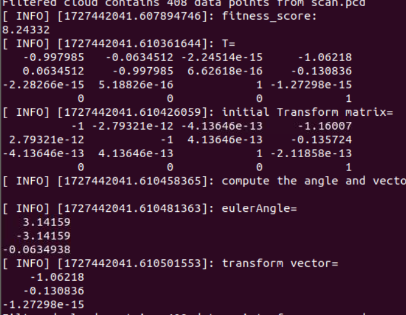
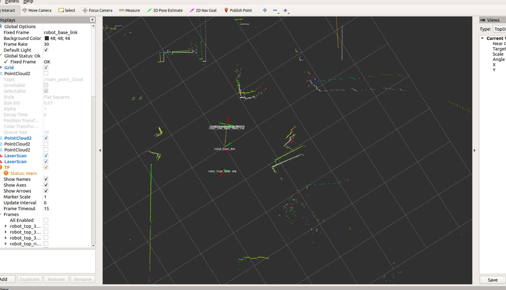

# Multi 2D-Lidar Lcalibration Pacakge
***Multi Lidar Calibration*** is ros-package that uses ndt to calibrate two single-line lasers and correct their the relative position relationship. 

## Installation ad Build

### Install Dependencies

Before using this package, you need to install the necessary dependencies. You can install them using `rosdep` or manually as shown below.

#### Install using `rosdep`

Navigate to the root of your workspace and run:

```bash
rosdep install --from-paths src --ignore-src -r -y
```

You should then build the library.

```sh
cd <your_catkin_work_space>
catkin build
```
After the build, you need to source the env first before running launch file.
```sh
source devel/setup.bash
```
Now run launch file 
```sh
roslaunch multi_lidar_calibration multi_lidar_calibration.launch
```

### Parameters for multi_lidar_calibration node (params.yaml)


- source_lidar_topic:
  -  The source 2D-Lidar rosmsg Topic

- target_lidar_topic:
  -  The target 2D-Lidar rosmsg Topic

- source_lidar_frame:
  - The name of source Lidar frame
- target_lidar_frame:
  - The name of target Lidar frame

- ndt_score:
  - min score for accepting calibrated relative pose

### ROS Published Topics

- **/final_point_cloud** (sensor_msgs::PointCloud):
  -  The final registered Points Cloud

### Example

As displayed in RViz, the white PointCloud represents the registered data, and you can directly retrieve the registered Transformation information from the terminal.





